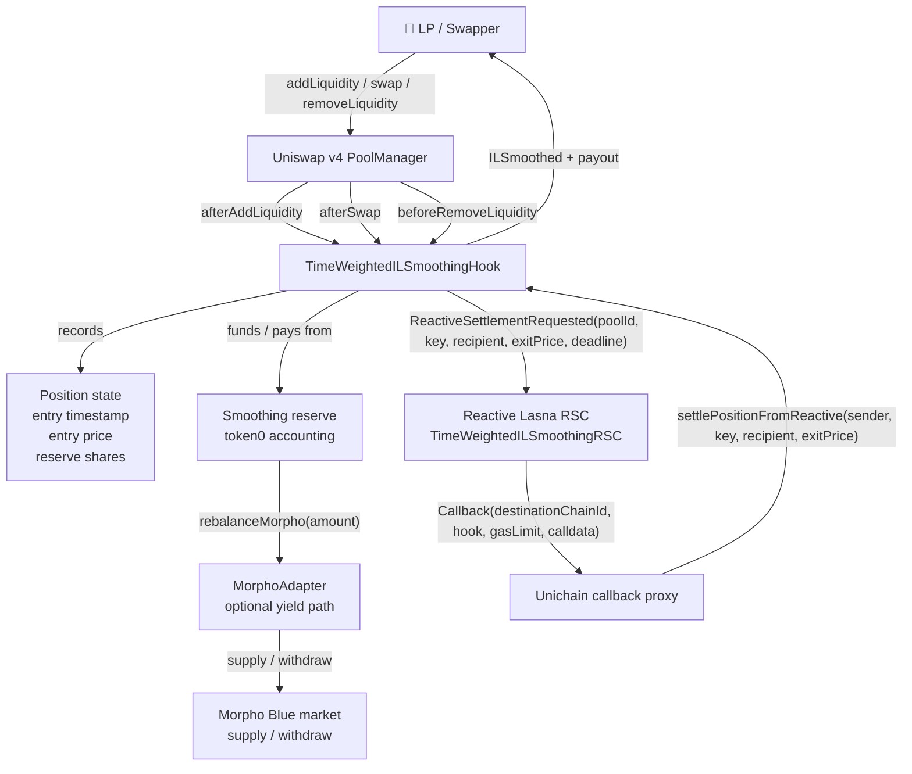
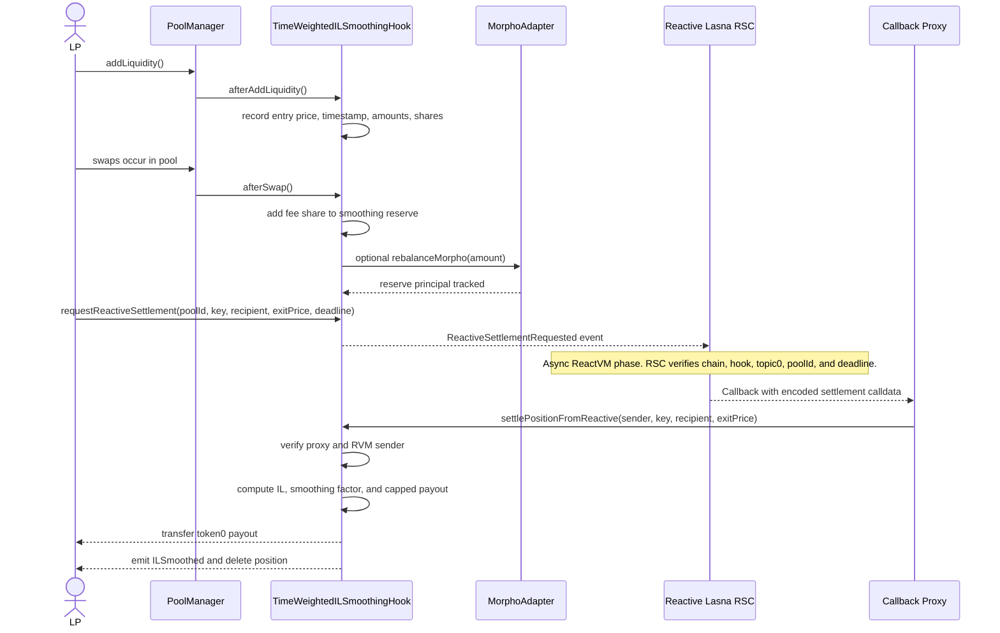
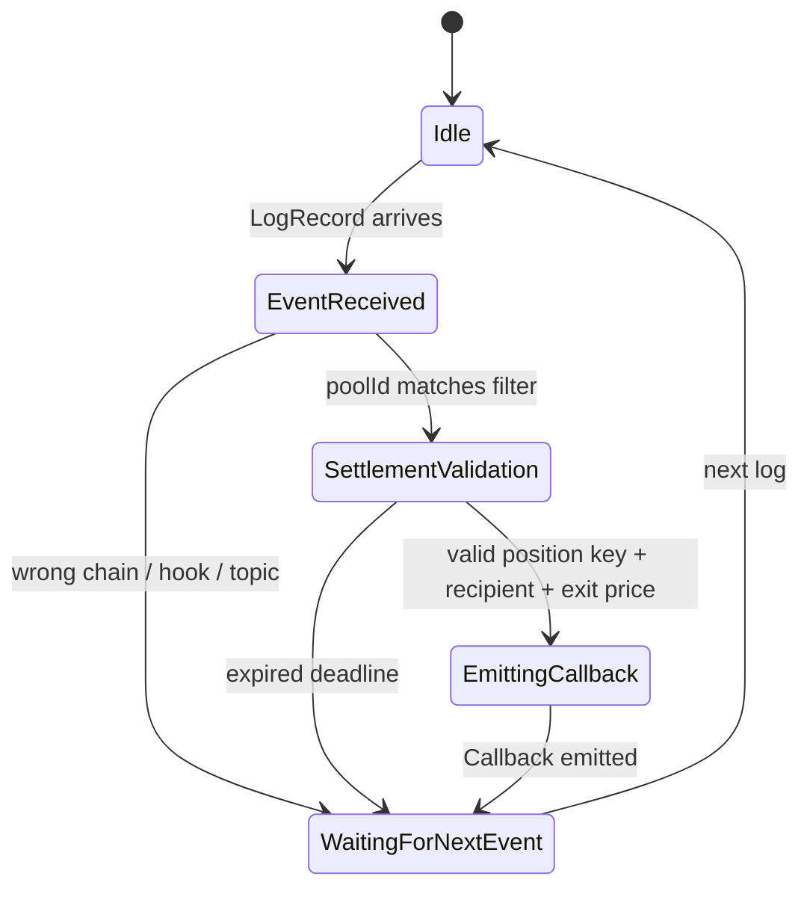
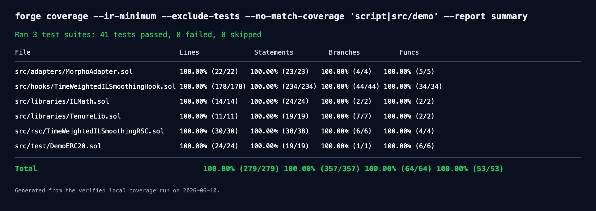

# 🛡️ TimeWeightedILSmoothing


*Stay longer, suffer less.*


---

TimeWeightedILSmoothing is a Uniswap v4 hook that reimburses part of a liquidity provider's impermanent loss based on how long the position stayed in the pool. It introduces a token0-denominated smoothing reserve, funds that reserve from swap activity and direct reserve deposits, and pays longer-tenured LPs up to 75% of computed IL at settlement. The hook is novel because it turns LP tenure into a native risk-accounting input instead of relying on emissions, points, or off-chain loyalty programs. Built for the UHI9 Hookathon — Impermanent Loss & Yield Systems.

| Field | Value |
| --- | --- |
| Hook lineup | UHI9 white space #5, Time-Weighted IL Smoothing |
| Owner / builder | Friend E |
| Prize tracks | Reactive Sponsor Prize · Uniswap General Prize |
| Live chains | Unichain Sepolia for hook and callback, Reactive Lasna for RSC |
| Hook callbacks | `afterAddLiquidity`, `afterSwap`, `beforeRemoveLiquidity` |
| Reactive Network | Yes, used for automated settlement callbacks |

> ⚛️ **Reactive Network Integration**
>
> TimeWeightedILSmoothing is powered by Reactive Smart Contracts (RSCs) deployed on Reactive Network. RSCs autonomously monitor on-chain events from Uniswap v4 and trigger callbacks without keepers, bots, or manual intervention. In this project, the Lasna RSC watches `ReactiveSettlementRequested` events and calls the hook back through the Unichain Sepolia callback proxy to settle an LP position.

## Table of Contents

- [The Problem](#the-problem)
- [The Solution](#the-solution)
- [Architecture](#architecture)
- [Core Components](#core-components)
- [Reactive Network Integration](#reactive-network-integration)
- [Demo Run](#demo-run)
- [Test Coverage](#test-coverage)
- [Local Development](#local-development)
- [Security Considerations](#security-considerations)
- [Known Limitations & Future Work](#known-limitations--future-work)
- [Contributing & License](#contributing--license)
- [Acknowledgements](#acknowledgements)

## The Problem

Impermanent loss is timing-blind. An LP who provided useful liquidity for months can crystallize the same exit loss as an LP who entered shortly before a price move, because the pool only sees the withdrawal state. That makes long-duration liquidity less attractive than short-duration or JIT-style participation, especially around volatile periods where price divergence can erase earned fees.

Prior hook experiments explored adjacent surfaces. FlexFee-style hooks adjust swap fees, Gainswap-style designs experiment with payoff shaping, xtreamly targets streaming-like behavior, and Idle Liquidity Yield Hook and YieldSync focus on yield generation. Those ideas are useful, but they do not directly answer a narrow retention question: should an LP who stayed longer receive better IL treatment when they leave?

TimeWeightedILSmoothing fills that gap. It makes LP tenure a first-class on-chain variable, records position entry state, funds a shared smoothing reserve, and uses that reserve to reduce realized IL at exit without creating protocol debt.

**TimeWeightedILSmoothing solves this by reimbursing computed IL from a capped smoothing reserve, with the reimbursement percentage increasing as LP tenure increases.**

## The Solution

The hook records each LP position's entry timestamp, entry price, deposit amounts, liquidity, tick range, and reserve shares when liquidity is added. At withdrawal or Reactive settlement, it computes an IL estimate from the entry and exit prices, applies the LP's tenure tier, caps the result to reserve capacity, and transfers token0 to the LP.

The reserve is solvent by construction. If the requested payout is larger than the LP's reserve entitlement or larger than available token0, the hook pays the capped amount and still allows normal withdrawal settlement to proceed.

The production default tier schedule is 7 days, 30 days, and 90 days. Demo deployments compress those windows to hours so judges can see two LPs experience the same price move but receive different protection because one stayed longer.

1. The LP adds liquidity, and `afterAddLiquidity` records entry time, entry price, deposit amounts, tick range, and reserve shares.
2. Swaps call `afterSwap`, which accounts a configurable share of swap activity into the smoothing reserve.
3. Idle reserve funds can be moved through `MorphoAdapter` so reserve capital can earn supply-side yield.
4. When a position is ready to settle, the hook computes estimated IL in token0 terms using entry and exit `sqrtPriceX96`.
5. The hook maps LP tenure to a smoothing factor: 0%, 25%, 50%, or 75% by default.
6. The hook caps the payout to reserve solvency and LP entitlement, then pays token0 to the LP and deletes the position.
7. For the Reactive demo path, the hook emits `ReactiveSettlementRequested`, the Lasna RSC reacts, and the Unichain callback proxy calls `settlePositionFromReactive`.

> ⚖️ **Risk Accounting:** The smoothing reserve absorbs the covered portion of computed IL; uncovered IL remains with the LP, and reserve depletion never creates debt or guaranteed claims against other LPs.

## Architecture

### System Overview Diagram



### User Journey Diagram



### RSC State Transition Diagram



## Core Components

### TimeWeightedILSmoothingHook.sol

`TimeWeightedILSmoothingHook` is the main Uniswap v4 hook that records LP tenure, accounts a smoothing reserve, computes IL, and settles capped reimbursements.

| Function | Visibility | Description |
| --- | --- | --- |
| `productionTierConfig()` | `public pure` | Returns the 7/30/90 day production tier schedule. |
| `demoTierConfig()` | `public pure` | Returns compressed 1/6/12 hour demo tiers. |
| `getHookPermissions()` | `public pure` | Declares `afterAddLiquidity`, `beforeRemoveLiquidity`, and `afterSwap`. |
| `setTierConfig(TierConfig)` | `external` | Owner-only tier update with config validation. |
| `configureReactive(address,address)` | `external` | Owner-only callback proxy and RVM sender configuration. |
| `fundReserve(uint256)` | `external` | Pulls reserve token from caller and increases reserve accounting. |
| `requestReactiveSettlement(...)` | `external` | Emits the origin event consumed by the Lasna RSC. |
| `settlePositionFromReactive(...)` | `external` | Authenticated Reactive callback path that settles a position. |
| `previewPayout(bytes32,uint160)` | `external view` | Returns total IL, requested payout, actual payout, and smoothing factor. |
| `rebalanceMorpho(uint256)` | `external` | Moves idle reserve through the Morpho adapter above the threshold. |
| `syncMorphoYield(uint256)` | `external` | Updates reserve accounting when observed Morpho balance increases. |

| Variable | Type | Description |
| --- | --- | --- |
| `reserveToken` | `address immutable` | Token0-style asset used for smoothing reserve payouts. |
| `morphoAdapter` | `address immutable` | Optional adapter used for reserve yield operations. |
| `owner` | `address` | Admin for tier config and Reactive auth configuration. |
| `callbackProxy` | `address` | Destination callback proxy allowed to call Reactive settlement. |
| `reactiveSender` | `address` | Expected RVM sender encoded into the callback payload. |
| `tierConfig` | `TierConfig` | Current tier durations, factors, and reserve fee share. |
| `reserve` | `ReserveState` | Total reserve balance, Morpho balance, shares, sync time, and yield. |
| `positions` | `mapping(bytes32 => PositionState)` | Position state keyed by LP, ticks, and salt. |

Hook permissions:

- ✅ `afterAddLiquidity`
- ✅ `beforeRemoveLiquidity`
- ✅ `afterSwap`
- ❌ `beforeInitialize`
- ❌ `afterInitialize`
- ❌ `beforeAddLiquidity`
- ❌ `afterRemoveLiquidity`
- ❌ `beforeSwap`
- ❌ `beforeDonate`
- ❌ `afterDonate`
- ❌ `beforeSwapReturnDelta`
- ❌ `afterSwapReturnDelta`
- ❌ `afterAddLiquidityReturnDelta`
- ❌ `afterRemoveLiquidityReturnDelta`

### TimeWeightedILSmoothingRSC.sol

`TimeWeightedILSmoothingRSC` is the Reactive Smart Contract deployed on Lasna that subscribes to settlement request events and emits destination callbacks.

| Function | Visibility | Description |
| --- | --- | --- |
| `constructor(...)` | `public` | Stores chain IDs, hook address, pool filter, topic0, gas limit, and callback sender, then attempts subscription outside VM mode. |
| `configureSubscription()` | `external` | Explicitly configures the Reactive subscription and records success. |
| `react(LogRecord)` | `external vmOnly` | Validates the log and emits the callback payload for the destination hook. |
| `_configureSubscription()` | `internal` | Calls the legacy Lasna system contract subscription endpoint. |

| Variable | Type | Description |
| --- | --- | --- |
| `ORIGIN_CHAIN_ID` | `uint256 immutable` | Chain where the hook emits `ReactiveSettlementRequested`. |
| `DESTINATION_CHAIN_ID` | `uint256 immutable` | Chain where the callback proxy submits settlement. |
| `HOOK` | `address immutable` | Hook address to monitor and call back. |
| `POOL_ID_FILTER` | `bytes32 immutable` | Optional pool ID filter; live demo uses a real Unichain v4 pool ID. |
| `SETTLEMENT_TOPIC0` | `uint256 immutable` | Topic0 for `ReactiveSettlementRequested(bytes32,bytes32,address,uint160,uint256)`. |
| `CALLBACK_GAS_LIMIT` | `uint64 immutable` | Gas limit sent with the Reactive callback event. |
| `CALLBACK_SENDER` | `address immutable` | Sender identity encoded into the callback payload. |
| `subscriptionConfigured` | `bool` | Tracks whether the Lasna subscription call succeeded. |

Subscription details:

| Field | Value |
| --- | --- |
| Origin chain | Unichain Sepolia, chain ID `1301` |
| Origin hook | `0x351Ef540C185454d80E0b34b97af30876b194640` |
| Pool ID filter | `0x3e573b701a437ab4b1aec3a94aaea3d74fa8e96a86947313024032dea757521d` |
| Event topic0 | `0xbcbeff20c5c5f2717bc9ac80cd59796fabc4cdfbd7142aee903da540dd02bdba` |
| Lasna RSC | `0x4C9e691d2e856C34ac7a02EF3568e1D83B3A8bCD` |

`react()` validates the origin chain, hook address, event topic, optional pool ID, position key, recipient, exit price, and deadline. It emits `Callback(DESTINATION_CHAIN_ID, HOOK, CALLBACK_GAS_LIMIT, payload)` where `payload` calls `settlePositionFromReactive(address,bytes32,address,uint160)`.

### MorphoAdapter.sol

`MorphoAdapter` isolates Morpho Blue supply and withdraw calls so the hook can keep reserve accounting separate from external lending logic.

| Function | Visibility | Description |
| --- | --- | --- |
| `deposit(uint256)` | `external` | Pulls reserve token, approves Morpho, supplies assets, and records deposited principal. |
| `withdraw(uint256,address)` | `external` | Withdraws assets from Morpho to the receiver and reduces deposited accounting. |
| `_safeApprove(address,address,uint256)` | `internal` | Handles ERC-20 approval with optional boolean return. |
| `_safeTransferFrom(address,address,address,uint256)` | `internal` | Handles ERC-20 transferFrom with optional boolean return. |

| Variable | Type | Description |
| --- | --- | --- |
| `asset` | `IERC20Minimal immutable` | Reserve token supplied into Morpho. |
| `morpho` | `IMorphoBlue immutable` | Morpho Blue market interface. |
| `marketParams` | `IMorphoBlue.MarketParams` | Market tuple used for supply and withdraw calls. |
| `deposited` | `uint256` | Adapter-side deposited principal accounting. |

### ILMath.sol

`ILMath` computes the v1 full-range IL approximation used by the hook's hackathon implementation.

| Function | Visibility | Description |
| --- | --- | --- |
| `computeILBps(uint160,uint160)` | `internal pure` | Computes IL in basis points from entry and exit prices. |
| `computeIL(uint160,uint160,uint256,uint256)` | `internal pure` | Converts IL basis points into token0 terms using deposit amounts. |

| Variable | Type | Description |
| --- | --- | --- |
| `Q96` | `uint256 constant` | Fixed-point scale used for Uniswap sqrt prices. |
| `BPS` | `uint256 constant` | Basis-point denominator. |

### TenureLib.sol

`TenureLib` validates tier configuration and maps position tenure to a smoothing factor.

| Function | Visibility | Description |
| --- | --- | --- |
| `validate(TierConfig)` | `internal pure` | Rejects invalid duration ordering or factors above 10,000 bps. |
| `factor(TierConfig,uint256,uint256)` | `internal pure` | Returns the tenure-based smoothing factor. |

| Variable | Type | Description |
| --- | --- | --- |
| `TierConfig` | `struct` | Duration, factor, and reserve fee-share configuration. |

### DemoERC20.sol

`DemoERC20` is a testnet/demo reserve token used to prove the hook flow without depending on a live production asset.

| Function | Visibility | Description |
| --- | --- | --- |
| `mint(address,uint256)` | `external` | Mints demo reserve tokens for testnet scripts. |
| `transfer(address,uint256)` | `external` | Standard demo ERC-20 transfer. |
| `transferFrom(address,address,uint256)` | `external` | Standard demo ERC-20 transferFrom with allowance accounting. |
| `approve(address,uint256)` | `external` | Standard demo ERC-20 approval. |

| Variable | Type | Description |
| --- | --- | --- |
| `name` | `string` | Demo token name. |
| `symbol` | `string` | Demo token symbol. |
| `decimals` | `uint8` | Token decimals. |
| `balanceOf` | `mapping(address => uint256)` | Demo token balances. |
| `allowance` | `mapping(address => mapping(address => uint256))` | Demo token allowances. |

## Reactive Network Integration

### Why Reactive Network?

Reactive Network is a good fit because settlement is event-driven, not scheduled. The hook can emit a pool-scoped request after a position is ready to settle, and the RSC can prove three separate layers: the origin event, the ReactVM processing transaction, and the destination callback. That is cleaner for this demo than a keeper loop because judges can inspect each transaction and verify that the destination settlement was triggered by the subscribed event.

### RSC Event Subscription

```solidity
// Event emitted by hook
event ReactiveSettlementRequested(
    bytes32 indexed poolId,
    bytes32 indexed positionKey,
    address indexed recipient,
    uint160 exitSqrtPriceX96,
    uint256 deadline
);

// Topic0 used for RSC subscription
bytes32 topic0 = keccak256(
    "ReactiveSettlementRequested(bytes32,bytes32,address,uint160,uint256)"
);
```

Live topic0:

```text
0xbcbeff20c5c5f2717bc9ac80cd59796fabc4cdfbd7142aee903da540dd02bdba
```

The live subscription was configured against:

```json
{
  "ChainId": 1301,
  "Contract": "0x351ef540c185454d80e0b34b97af30876b194640",
  "Topics": [
    "0xbcbeff20c5c5f2717bc9ac80cd59796fabc4cdfbd7142aee903da540dd02bdba",
    "0x3e573b701a437ab4b1aec3a94aaea3d74fa8e96a86947313024032dea757521d",
    null,
    null
  ],
  "Configs": [
    {
      "Contract": "0x4c9e691d2e856c34ac7a02ef3568e1d83b3a8bcd",
      "RvmId": "0x4b992f2fbf714c0fcbb23bac5130ace48cad00cd",
      "Active": true
    }
  ]
}
```

### ReactVM Computation

The RSC keeps no complex financial state. It is intentionally deterministic: validate the log, decode the requested settlement, check the deadline, and emit one callback for that exact position.

```solidity
function react(LogRecord calldata log) external vmOnly {
    if (log.chain_id != ORIGIN_CHAIN_ID) return;
    if (log._contract != HOOK) return;
    if (log.topic_0 != SETTLEMENT_TOPIC0) return;
    if (POOL_ID_FILTER != bytes32(0) && bytes32(log.topic_1) != POOL_ID_FILTER) return;

    bytes32 positionKey = bytes32(log.topic_2);
    address recipient = address(uint160(log.topic_3));
    (uint160 exitSqrtPriceX96, uint256 deadline) = abi.decode(log.data, (uint160, uint256));
    if (deadline != 0 && block.timestamp > deadline) return;

    bytes memory payload = abi.encodeWithSignature(
        "settlePositionFromReactive(address,bytes32,address,uint160)",
        CALLBACK_SENDER,
        positionKey,
        recipient,
        exitSqrtPriceX96
    );

    emit Callback(DESTINATION_CHAIN_ID, HOOK, CALLBACK_GAS_LIMIT, payload);
}
```

### Callback Flow

```text
[Unichain Sepolia] Hook emits ReactiveSettlementRequested
    → Lasna RSC detects the exact hook + poolId + topic0 filter
    → react() executes on ReactVM
    → RSC emits Callback(1301, hookAddress, gasLimit, calldata)
    → Reactive Network relayer submits tx to Unichain callback proxy
    → Hook's settlePositionFromReactive() executes on Unichain Sepolia
    → Hook emits ILSmoothed and ReactiveSettlementExecuted
```

### Access Control

The destination callback uses two checks. `msg.sender` must be the Reactive callback proxy, and the encoded `sender` must match the authorized RVM sender.

```solidity
function settlePositionFromReactive(
    address sender,
    bytes32 key,
    address recipient,
    uint160 exitPrice
) external returns (uint256 payout) {
    if (msg.sender != callbackProxy) revert NotReactiveCallback();
    if (sender != reactiveSender) revert InvalidReactiveSender();
    PositionState storage pos = positions[key];
    if (!pos.active || recipient == address(0) || exitPrice == 0) revert InvalidPosition();
    payout = _settlePosition(key, recipient, pos, exitPrice);
    emit ReactiveSettlementExecuted(sender, key, recipient, payout);
}
```

## Demo Run

The demo script proves the full lifecycle: deploy and configure the hook, fund the smoothing reserve, create a long-tenured LP position, emit a Reactive settlement request, observe the Lasna RVM transaction, and verify the destination callback settlement. It presents the same flow from a user's perspective: the LP sees a payout preview before relay and a zeroed preview after the position is settled.

### Deployed Contracts

| Contract | Address | Explorer |
| --- | --- | --- |
| TimeWeightedILSmoothingHook | `0x351Ef540C185454d80E0b34b97af30876b194640` | [🔗 View on Explorer](https://sepolia.uniscan.xyz/address/0x351Ef540C185454d80E0b34b97af30876b194640) |
| Demo reserve token | `0x40B22B4540B7914B1E7a01faA78E57ac768d6382` | [🔗 View on Explorer](https://sepolia.uniscan.xyz/address/0x40B22B4540B7914B1E7a01faA78E57ac768d6382) |
| Uniswap v4 PoolManager | `0x00B036B58a818B1BC34d502D3fE730Db729e62AC` | [🔗 View on Explorer](https://sepolia.uniscan.xyz/address/0x00B036B58a818B1BC34d502D3fE730Db729e62AC) |
| Reactive Lasna RSC | `0x4C9e691d2e856C34ac7a02EF3568e1D83B3A8bCD` | [🔗 View on Explorer](https://lasna.reactscan.net/address/0x4C9e691d2e856C34ac7a02EF3568e1D83B3A8bCD) |
| Unichain callback proxy | `0x9299472A6399Fd1027ebF067571Eb3e3D7837FC4` | [🔗 View on Explorer](https://sepolia.uniscan.xyz/address/0x9299472A6399Fd1027ebF067571Eb3e3D7837FC4) |

Live pool ID:

```text
0x3e573b701a437ab4b1aec3a94aaea3d74fa8e96a86947313024032dea757521d
```

### End-to-End Demo Steps

#### Step 1 — Deploy Demo Reserve Token

**Action:** Deploy the ERC-20 reserve token used by the demo.  
**Expected:** Token contract exists on Unichain Sepolia.  
**Result:** ✅ Demo reserve token deployed.  
**Transaction:** [`0x7e4a...c25`](https://sepolia.uniscan.xyz/tx/0x7e4aa7d9e1b67107ab3659415781e22e4353093c1ea1dc72829efe48a4b2ec25)

#### Step 2 — Mint Reserve Token

**Action:** Mint token0-style reserve assets for funding the smoothing reserve.  
**Expected:** Demo wallet receives reserve token balance.  
**Result:** ✅ Token mint completed.  
**Transaction:** [`0x4913...2a3`](https://sepolia.uniscan.xyz/tx/0x4913e1ba12668b76bca3f37453528a6f6e200b3133440a12869caf20c4e322a3)

#### Step 3 — Deploy Reactive-Capable Hook

**Action:** Deploy `TimeWeightedILSmoothingHook` with demo tier config.  
**Expected:** Hook contract is live and can later be configured with callback proxy and RVM sender.  
**Result:** ✅ Hook deployed.  
**Transaction:** [`0x6820...90e`](https://sepolia.uniscan.xyz/tx/0x6820e3e4bb00e097dd7afdf23405ab046029d749e4555a8808a2173d985d990e)

#### Step 4 — Initialize v4 Pool

**Action:** Initialize a real Unichain Sepolia v4 pool for the deployed hook.  
**Expected:** Pool ID is created and can be used in the RSC subscription filter.  
**Result:** ✅ Pool initialized.  
**Transaction:** [`0x9707...ab5`](https://sepolia.uniscan.xyz/tx/0x9707228702713d50dc0d623140776cc8694b4bf425f40153080107e12d780ab5)

#### Step 5 — Deploy Lasna RSC

**Action:** Deploy `TimeWeightedILSmoothingRSC` on Reactive Lasna.  
**Expected:** RSC stores origin chain, destination chain, hook, pool filter, topic0, and callback sender.  
**Result:** ✅ RSC deployed.  
**Transaction:** [`0x33ec...481`](https://lasna.reactscan.net/tx/0x33ec3e372d728decc67bebace03dea45a0a8ce9b1a485e46cfb3feae42c54881)

#### Step 6 — Fund RSC

**Action:** Send Lasna gas funds to the RSC/RVM path.  
**Expected:** Reactive callback path has funds for processing.  
**Result:** ✅ RSC funded.  
**Transaction:** [`0x10cc...6b5`](https://lasna.reactscan.net/tx/0x10cc3e1008a40ea0ad97d5358fd4d1509bfaa76b2bc824530fc645e63d4636b5)

#### Step 7 — Configure Explicit Subscription

**Action:** Call `configureSubscription()` on Lasna.  
**Expected:** `rnk_getFilters` shows an active filter for hook, topic0, pool ID, RSC, and RVM ID.  
**Result:** ✅ Active subscription confirmed.  
**Transaction:** [`0xbb37...7f5`](https://lasna.reactscan.net/tx/0xbb3798e0069e612f43806fd321256b949d1a2035abd818e18f633c327084c7f5)

#### Step 8 — Configure Destination Reactive Auth

**Action:** Configure the hook with the Unichain callback proxy and RVM sender.  
**Expected:** Hook will reject callbacks unless both identities match.  
**Result:** ✅ Auth configured.  
**Transaction:** [`0x91b7...4c5`](https://sepolia.uniscan.xyz/tx/0x91b79b6eaa7d9273faf24261a813a2657281cba902897feb21d2ef15746634c5)

#### Step 9 — Fund Smoothing Reserve

**Action:** Approve and fund the hook reserve with `10,000` token0.  
**Expected:** Reserve has enough capacity for the demo payout.  
**Result:** ✅ Reserve funded.  
**Transaction:** [`0x54d3...02d`](https://sepolia.uniscan.xyz/tx/0x54d33f6ab17ca620e3d1f453fd6818627915fcc3e03bf0b4cf98e310b52850d2), [`0x0b64...dff`](https://sepolia.uniscan.xyz/tx/0x0b6490cc4b21ee00df707093d6fd055d76e71a69a1b47be728900aff2817bdff)

#### Step 10 — Record Tier 3 LP Position

**Action:** Record a demo LP position old enough for Tier 3 protection.  
**Expected:** Position preview shows a 75% smoothing factor after the simulated price move.  
**Result:** ✅ Tier 3 position recorded.  
**Transaction:** [`0x1f8b...270`](https://sepolia.uniscan.xyz/tx/0x1f8b7eff2ed160c68683376a8701deaf07e3299ad08ca99e1a8547f25de86270)

#### Step 11 — Emit Origin Settlement Request

**Action:** Emit `ReactiveSettlementRequested` for the exact pool and position.  
**Expected:** Lasna RSC sees the event through the configured filter.  
**Result:** ✅ Origin event emitted.  
**Transaction:** [`0x2c26...ca2`](https://sepolia.uniscan.xyz/tx/0x2c26ad167d9c70290acef77e979c2beff430ceb56fd3cf7e180e14cfd8084ca2)

#### Step 12 — Prove Lasna RVM Reaction

**Action:** Poll RNK near the RVM tail and find the RVM transaction whose `refTx` is the origin event.  
**Expected:** RVM transaction references the Unichain origin transaction.  
**Result:** ✅ Lasna RVM processed the origin event.  
**Transaction:** [`0xfb97...db9`](https://lasna.reactscan.net/tx/0xfb97cb88692543809fe3d7b3ca07fe85f5f2b9e33c4860896aaa209be0167db9)

#### Step 13 — Prove Destination Callback Settlement

**Action:** Poll Unichain Sepolia for `ReactiveSettlementExecuted` on the hook.  
**Expected:** Callback proxy calls the hook, the hook emits `ILSmoothed`, and the position is deleted.  
**Result:** ✅ Destination callback settled the position.  
**Transaction:** [`0x02cc...255`](https://sepolia.uniscan.xyz/tx/0x02cc727fcf4f4043b86c3e883d99789584c091fba4d344c7e4e9497fea001255)

### Demo Output

```bash
$ ./script/run_reactive_demo.sh
================================================================================
TimeWeighted IL Smoothing Hook - Reactive demo
================================================================================
User story:
  1. A long-tenured LP has already supplied liquidity.
  2. Price moves against the LP, creating impermanent loss.
  3. The hook calculates the LP's tenure tier and expected IL reimbursement.
  4. A pool-scoped origin event asks Reactive Network to settle the position.
  5. Lasna RVM observes that event and emits a callback payload.
  6. The Unichain callback proxy calls the hook.
  7. The LP receives the smoothing reserve payout and the position is closed.

Contracts and network:
  Hook:             0x351Ef540C185454d80E0b34b97af30876b194640
  Reserve token:    0x40B22B4540B7914B1E7a01faA78E57ac768d6382
  Pool ID:          0x3e573b701a437ab4b1aec3a94aaea3d74fa8e96a86947313024032dea757521d
  Callback proxy:   0x9299472A6399Fd1027ebF067571Eb3e3D7837FC4
  RVM sender:       0x4b992F2Fbf714C0fCBb23baC5130Ace48CaD00cd
  RSC:              0x4C9e691d2e856C34ac7a02EF3568e1D83B3A8bCD
  Destination RPC:  $UNICHAIN_SEPOLIA_RPC_URL
  Lasna RPC:        https://lasna-rpc.rnk.dev/

================================================================================
Pre-flight: prove Reactive integration is wired
================================================================================
Hook callbackProxy(): 0x9299472A6399Fd1027ebF067571Eb3e3D7837FC4
Hook reactiveSender(): 0x4b992F2Fbf714C0fCBb23baC5130Ace48CaD00cd

================================================================================
Phase 1: origin-chain setup and event emission
================================================================================
Configure hook Reactive auth:        https://sepolia.uniscan.xyz/tx/0x91b79b6eaa7d9273faf24261a813a2657281cba902897feb21d2ef15746634c5
Approve reserve token:              https://sepolia.uniscan.xyz/tx/0x54d33f6ab17ca620e3d1f453fd6818627915fcc3e03bf0b4cf98e310b52850d2
Fund smoothing reserve:             https://sepolia.uniscan.xyz/tx/0x0b6490cc4b21ee00df707093d6fd055d76e71a69a1b47be728900aff2817bdff
Record Tier 3 LP position:          https://sepolia.uniscan.xyz/tx/0x1f8b7eff2ed160c68683376a8701deaf07e3299ad08ca99e1a8547f25de86270
Origin ReactiveSettlementRequested: https://sepolia.uniscan.xyz/tx/0x2c26ad167d9c70290acef77e979c2beff430ceb56fd3cf7e180e14cfd8084ca2
Origin block:                       1301
Demo position key:                  0xffd338a599306587763666b8f55f85e3fe52af66c013e7bcc5b05915639acf97
User-facing payout preview before relay:
  (totalIL, requestedPayout, actualPayout, smoothingFactorBps) = (57100000000000000000, 42825000000000000000, 42825000000000000000, 7500)

================================================================================
Phase 2: Lasna RVM proof
================================================================================
Lasna RVM processed origin event:   https://lasna.reactscan.net/tx/0xfb97cb88692543809fe3d7b3ca07fe85f5f2b9e33c4860896aaa209be0167db9
RVM tx number:                      0x644
Ref chain ID:                       1301
Ref origin tx:                      0x2c26ad167d9c70290acef77e979c2beff430ceb56fd3cf7e180e14cfd8084ca2
Ref event index:                    2

================================================================================
Phase 3: destination callback proof
================================================================================
Destination callback settlement:    https://sepolia.uniscan.xyz/tx/0x02cc727fcf4f4043b86c3e883d99789584c091fba4d344c7e4e9497fea001255
Destination receipt to:             0x9299472A6399Fd1027ebF067571Eb3e3D7837FC4
Hook events emitted:                ILSmoothed, ReactiveSettlementExecuted

================================================================================
Phase 4: final user-facing state
================================================================================
Decoded settlement:
  Total IL:                         57.1 token0
  Smoothing factor:                 7500 bps
  Reserve payout:                   42.825 token0
  Final reserve balance:            9957.175 token0
  Position preview after callback:  (0, 0, 0, 0)

================================================================================
Demo proof summary
================================================================================
Origin setup/configure tx:          https://sepolia.uniscan.xyz/tx/0x91b79b6eaa7d9273faf24261a813a2657281cba902897feb21d2ef15746634c5
Origin reserve funding tx:          https://sepolia.uniscan.xyz/tx/0x0b6490cc4b21ee00df707093d6fd055d76e71a69a1b47be728900aff2817bdff
Origin LP position tx:              https://sepolia.uniscan.xyz/tx/0x1f8b7eff2ed160c68683376a8701deaf07e3299ad08ca99e1a8547f25de86270
Origin Reactive request tx:         https://sepolia.uniscan.xyz/tx/0x2c26ad167d9c70290acef77e979c2beff430ceb56fd3cf7e180e14cfd8084ca2
Lasna RVM tx:                       https://lasna.reactscan.net/tx/0xfb97cb88692543809fe3d7b3ca07fe85f5f2b9e33c4860896aaa209be0167db9
Destination callback tx:            https://sepolia.uniscan.xyz/tx/0x02cc727fcf4f4043b86c3e883d99789584c091fba4d344c7e4e9497fea001255
```

## Test Coverage

This project maintains 100% test coverage across all source contracts, verified with `forge coverage`.

### Coverage Report

Command used:

```bash
forge coverage --ir-minimum --exclude-tests --no-match-coverage 'script|src/demo' --report summary
```

Coverage table:

```text
╭-------------------------------------------+-------------------+-------------------+-----------------+-----------------╮
| File                                      | % Lines           | % Statements      | % Branches      | % Funcs         |
+=======================================================================================================================+
| src/adapters/MorphoAdapter.sol            | 100.00% (22/22)   | 100.00% (23/23)   | 100.00% (4/4)   | 100.00% (5/5)   |
|-------------------------------------------+-------------------+-------------------+-----------------+-----------------|
| src/hooks/TimeWeightedILSmoothingHook.sol | 100.00% (178/178) | 100.00% (234/234) | 100.00% (44/44) | 100.00% (34/34) |
|-------------------------------------------+-------------------+-------------------+-----------------+-----------------|
| src/libraries/ILMath.sol                  | 100.00% (14/14)   | 100.00% (24/24)   | 100.00% (2/2)   | 100.00% (2/2)   |
|-------------------------------------------+-------------------+-------------------+-----------------+-----------------|
| src/libraries/TenureLib.sol               | 100.00% (11/11)   | 100.00% (19/19)   | 100.00% (7/7)   | 100.00% (2/2)   |
|-------------------------------------------+-------------------+-------------------+-----------------+-----------------|
| src/rsc/TimeWeightedILSmoothingRSC.sol    | 100.00% (30/30)   | 100.00% (38/38)   | 100.00% (6/6)   | 100.00% (4/4)   |
|-------------------------------------------+-------------------+-------------------+-----------------+-----------------|
| src/test/DemoERC20.sol                    | 100.00% (24/24)   | 100.00% (19/19)   | 100.00% (1/1)   | 100.00% (6/6)   |
|-------------------------------------------+-------------------+-------------------+-----------------+-----------------|
| Total                                     | 100.00% (279/279) | 100.00% (357/357) | 100.00% (64/64) | 100.00% (53/53) |
╰-------------------------------------------+-------------------+-------------------+-----------------+-----------------╯
```

### Coverage Screenshot



### Test Suite Summary

| Test File | Tests | Coverage |
| --- | ---: | ---: |
| `test/ILMath.t.sol` | 7 | 100% |
| `test/TenureLib.t.sol` | 7 | 100% |
| `test/TimeWeightedILSmoothingHook.t.sol` | 27 | 100% |

Total: 41 tests passing · 100% line · 100% branch · 100% function

```bash
forge test --match-path "test/**" -vvv
```

```bash
forge coverage --report lcov
```

## Local Development

### Prerequisites

```bash
# Required
forge --version    # Foundry
node --version     # Node.js for frontend scripts
```

### Installation

```bash
git clone https://github.com/najnomics/timeweighted-il-smoothing-hook.git
cd timeweighted-il-smoothing-hook
git submodule update --init --recursive
forge install
```

### Environment Setup

```bash
cp .env.example .env
# Fill in:
# PRIVATE_KEY=
# UNICHAIN_SEPOLIA_RPC_URL=
# REACTIVE_LASNA_RPC_URL=https://lasna-rpc.rnk.dev/
# REACTIVE_LASNA_SYSTEM_CONTRACT=0x0000000000000000000000000000000000fffFfF
# TIMEWEIGHTED_HOOK=
# TIMEWEIGHTED_TOKEN=
# TIMEWEIGHTED_POOL_ID=
# TIMEWEIGHTED_CALLBACK_PROXY=
# TIMEWEIGHTED_RVM_SENDER=
# TIMEWEIGHTED_RSC=
```

### Run Tests

```bash
forge test -vvv
```

### Deploy

```bash
# Deploy hook on Unichain Sepolia
forge script script/DeployTimeWeightedILSmoothing.s.sol \
  --rpc-url "$UNICHAIN_SEPOLIA_RPC_URL" \
  --broadcast \
  --private-key "$PRIVATE_KEY"

# Initialize pool
forge script script/InitializeTimeWeightedPool.s.sol \
  --rpc-url "$UNICHAIN_SEPOLIA_RPC_URL" \
  --broadcast \
  --private-key "$PRIVATE_KEY"

# Deploy RSC on Reactive Lasna
forge script script/DeployTimeWeightedReactiveRSC.s.sol \
  --rpc-url "$REACTIVE_LASNA_RPC_URL" \
  --broadcast \
  --legacy \
  --private-key "$PRIVATE_KEY"
```

### Run Demo

```bash
# Full proof wrapper with tx URL printing and RNK polling
./script/run_reactive_demo.sh

# Local Foundry-only demonstration
forge script script/DemoTimeWeightedILSmoothing.s.sol -vvvv
```

Frontend:

```bash
cd frontend
npm install
npm run dev
```

## Security Considerations

1. **Reactive callback access control** — `settlePositionFromReactive` requires `msg.sender == callbackProxy` and payload `sender == reactiveSender`, so a relayed call must come through the configured proxy and expected RVM identity.
2. **Tier configuration validation** — tier durations must be strictly increasing and factors cannot exceed `10_000` bps, preventing nonsensical payout schedules.
3. **Reserve solvency cap** — payouts are capped by requested amount, LP reserve entitlement, and actual token balance, so reserve accounting cannot intentionally go negative.
4. **Overflow and underflow protection** — Solidity `0.8.26` checked arithmetic and Uniswap `FullMath.mulDiv` are used for fixed-point multiplication and division.
5. **Graceful Reactive degradation** — if Reactive is not configured, `requestReactiveSettlement` reverts, but direct hook lifecycle settlement and owner-directed demo settlement remain available. (Acknowledged — acceptable tradeoff because the core hook is standalone while Reactive is the automated settlement path.)
6. **MEV surface** — a public settlement request reveals the target exit price and position key before callback execution, but the payout is capped by pre-recorded position state and reserve entitlement. (Acknowledged — acceptable tradeoff because settlement requests are explicit and demo-oriented in v1.)
7. **Reentrancy considerations** — payout state is reduced before token transfer and the position is deleted during settlement, limiting repeat-claim risk around ERC-20 transfer behavior.
8. **PoolManager identity model** — v4 callbacks receive router context through `sender`; the hook supports `hookData` to identify the LP instead of assuming `msg.sender` is the end user.
9. **Morpho adapter isolation** — external supply and withdraw calls are isolated in `MorphoAdapter`, while hook accounting treats failed or unavailable withdraws as a bounded reserve-liquidity condition.
10. **Known IL approximation** — v1 uses a full-range IL approximation for all positions. (Acknowledged — acceptable tradeoff because the hackathon scope prioritizes tenure and reserve mechanics before exact concentrated-liquidity math.)

## Known Limitations & Future Work

### Current Limitations

- ⚠️ The v1 IL formula uses a full-range approximation and can differ from exact concentrated-liquidity IL for tight ranges.
- ⚠️ The live proof uses a demo reserve token and direct reserve funding rather than production swap fee capture at scale.
- ⚠️ Morpho integration is implemented and tested through an adapter, but the live E2E did not require a production Morpho market.
- ⚠️ Reserve payouts are not guaranteed; they are capped by reserve balance and LP entitlement.
- ⚠️ Tier configuration is owner-controlled in this hackathon version and has no timelock.
- ⚠️ The frontend is a demo UI and simulator, not a wallet-connected production application.

### Future Work

- Implement exact concentrated-liquidity IL using v4 math primitives so payout estimates match tick-range behavior more closely.
- Add dual-token reserve support so asymmetric pools can reimburse in whichever asset best matches the LP's loss profile.
- Add governance and timelock controls for tier schedules, reserve fee share, Reactive auth, and Morpho market configuration.
- Wire the frontend to deployed contracts for live position inspection, reserve dashboards, and settlement status tracking.
- Add fork tests against selected Morpho Blue markets to validate adapter behavior with live market accounting.
- Add a continuous smoothing curve instead of discrete tiers so payout changes gradually with tenure.

## Contributing & License

Contributions should follow the standard fork, branch, and pull request flow:

1. Fork the repository.
2. Create a feature branch.
3. Add or update tests for the change.
4. Run `forge test -vvv` before opening a PR.
5. Include any relevant demo, deployment, or coverage notes in the PR description.

This project is released under the MIT License. See [`LICENSE`](./LICENSE).

## Acknowledgements

- Uniswap Hook Incubator UHI9 and Atrium Academy for the Impermanent Loss & Yield Systems theme.
- Reactive Network team for the legacy Lasna endpoint, `reactive-lib`, and callback architecture used in the live proof.
- Uniswap Labs and the Uniswap v4 contributors for the PoolManager and hook architecture.
- Morpho contributors for the lending-market interface used by the reserve adapter.
- Prior UHI hook work including FlexFee, Gainswap, xtreamly, Idle Liquidity Yield Hook, and YieldSync, which helped frame the white space around tenure-weighted IL smoothing.
